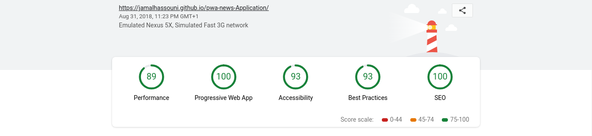

## Details 
I created  a simple  News Progressive Web App (PWA) application that brought news from a variety of sources using [Newsapi](https://newsapi.org) and Javascript
The application is responsive and easy to use
Online demo can be found on [https://jamalhassouni.github.io/pwa-news-Application/](https://jamalhassouni.github.io/pwa-news-Application/)

Home page : 


Phones : 


Lighthouse Results : 



## Installing / Getting started

To install this project you need to clone or download it.


```shell
git clone https://github.com/jamalhassouni/pwa-news-Application.git
cd pwa-news-Application
```
## Running locally
Serve folder with your server of choice.
 For instance 
1. by using  `npm install -g serve`.

2. Make sure you are in the same path 
```shell 
   cd pwa-news-Application 
```
3. Run `serve .`
4. Now you can browse [http://localhost:5000](http://localhost:5000)


## Technology

- HTML
- CSS
- Javascript
- ES6 